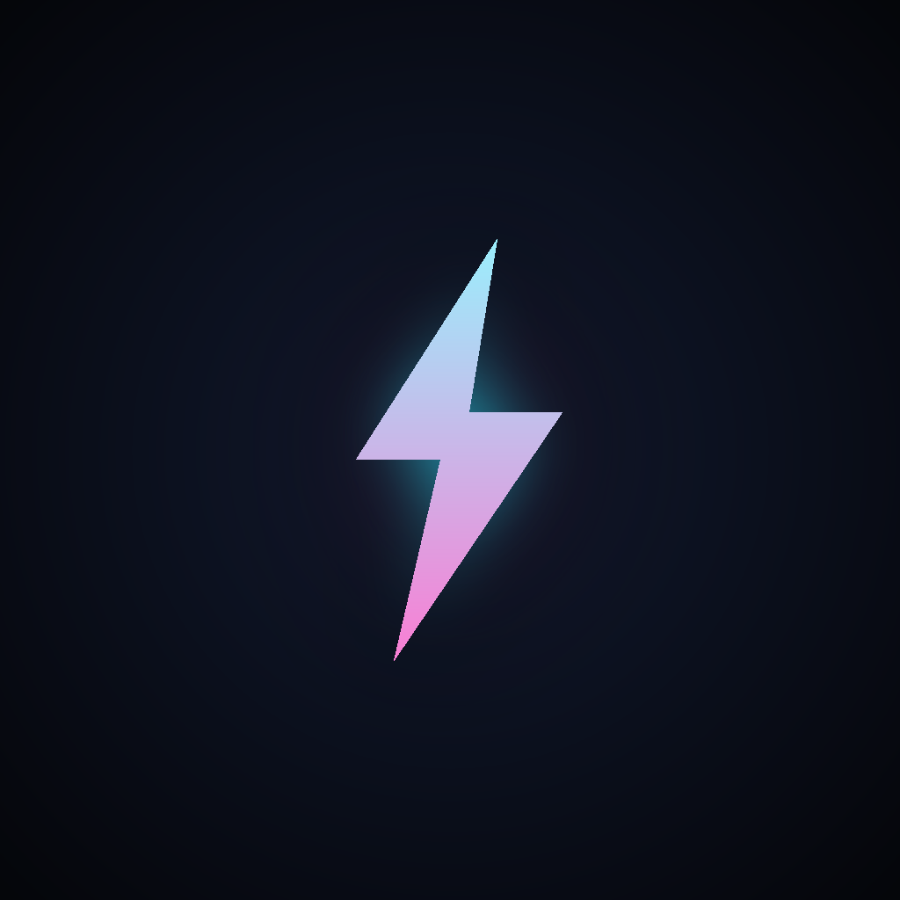

# ⚡ VOLT — One Tap. Pure Reflex.

Ein süchtig machendes Neon-Arcade-Game. Ein Tap – wie weit kommst du?
Läuft im Browser (PWA, offline, installierbar) **und** als native Android-App (Capacitor).



---

## 🎮 Spielprinzip

- **Ein Tap** (Touch / Klick / Leertaste) lässt den Funken steigen – Schwerkraft zieht ihn runter.
- Flieg durch die Lücken in den Energiebarrieren.
- **GRAZE (Suchtfaktor):** knapp an Kanten vorbeischrammen → **Combo-Multiplikator** → fette Punkte.
- **⚡ Energie** sammeln → im Shop **Skins** freischalten. **5 Zonen** wechseln die Farbwelt.
- **Revive:** nach dem Tod 1× weiterspielen (auf CrazyGames per Rewarded-Video).
- **Daily Challenge:** täglich gleicher Seed für alle.
- **Pause**, Highscore, Share – alles drin.

## 📁 Projektstruktur

```
VOLT/
├── www/                 ← das Spiel (Web/PWA – DAS hier hosten oder bei CrazyGames einreichen)
│   ├── index.html       ← komplettes Spiel (ein File)
│   ├── manifest.json · sw.js
│   └── icons/
├── assets/              ← Quell-Icon/Splash für die native App (icon.png 1024, splash.png 2732)
├── capacitor.config.json
├── package.json
├── make_icons.py · make_resources.py   ← generieren die Grafiken (Python + Pillow)
└── .github/workflows/build-apk.yml     ← baut die Android-APK automatisch in der Cloud
```

## ▶️ Web lokal testen

```bash
cd www
python -m http.server 8137
# → http://127.0.0.1:8137/index.html
```

## 📱 Android-APK bauen (automatisch, in der Cloud)

Die APK wird per **GitHub Actions** gebaut (kein lokales Android-SDK nötig):

1. Repo zu GitHub pushen (Branch `main`) → der Build startet automatisch.
2. Alternativ manuell: GitHub → **Actions** → *Build Android APK* → **Run workflow**.
3. APK herunterladen:
   - Als **Artifact** unter dem fertigen Action-Run, **oder**
   - bei manuellem Run als **Release** (`VOLT-v1.1-debug.apk`).
4. Auf dem Handy: „Installation aus unbekannten Quellen" erlauben → APK öffnen → installieren.

> Das ist eine **Debug-APK** – perfekt zum Testen. Für den Play Store braucht es später einen
> signierten Release-Build (eigener Keystore) – kann ich ergänzen.

Lokal bauen (nur wenn Android SDK + JDK 17 installiert sind):
```bash
npm install
npx cap add android
npx capacitor-assets generate --android
npx cap sync android
cd android && ./gradlew assembleDebug   # -> android/app/build/outputs/apk/debug/app-debug.apk
```

---

## 🕹️ Bei CrazyGames einreichen (Schritt für Schritt)

Ja, das geht wirklich unkompliziert – es ist ein HTML5-Upload:

1. **Account:** auf [developer.crazygames.com](https://developer.crazygames.com) registrieren (kostenlos).
2. **Spiel zippen:** den **Inhalt von `www/`** zippen, sodass `index.html` **direkt in der ZIP-Wurzel** liegt
   (nicht der `www`-Ordner selbst). Also: `index.html`, `manifest.json`, `sw.js`, `icons/` → in die ZIP.
3. **Neues Spiel anlegen:** „Submit game" → ZIP hochladen. Titel *VOLT*, Kategorie *Arcade / Casual*,
   Beschreibung, Tags (arcade, one-tap, neon, reflex), ein Thumbnail (Icon/Splash aus `assets/`).
4. **QuickPlay-Check:** CrazyGames testet automatisch, ob das Spiel lädt & im Vollbild/Iframe läuft.
   VOLT ist responsive und nutzt keine externen Abhängigkeiten – läuft direkt.
5. **Ads (Geld):** die **CrazyGames-SDK ist bereits eingebaut** (`www/index.html`, Objekt `CG`).
   Sie aktiviert sich automatisch auf der CrazyGames-Domain: Midgame-Ads beim Neustart,
   **Rewarded-Video** fürs „⚡ WEITER" (Revive). Nichts weiter nötig.
6. **Review:** Einreichen → CrazyGames prüft manuell (meist wenige Tage) → live + Umsatzbeteiligung.

**Testen wie auf CrazyGames (SDK aktiv):** hänge `?cg=1` an die URL, dann versucht das Spiel die
SDK zu laden (nur zu Testzwecken).

### Weitere Plattformen
Dasselbe ZIP passt meist auch für **Poki**, **GameDistribution**, **GameMonetize** – überall Reichweite + RevShare.

---

## 💰 Monetarisierung – Übersicht

1. **CrazyGames / Poki** (schnellster Weg, SDK schon drin).
2. **Play Store** (diese Capacitor-App → signierter Release-Build) + AdMob/IAP.
3. **Skins gegen echtes Geld** via Stripe.
4. **Whitelabel** für Agentur-Kunden (Branding/Farben tauschen, Highscore = Lead-Capture).

## 🔧 Tuning
Alles oben im `<script>` von `www/index.html`: `GRAV`, `THRUST`, `baseSpeed`, `SKINS`, `ZONES`,
Graze-Radius `gz`, `MAX_FREE_REVIVES`.

---
Made with ⚡ — viel Erfolg beim Viral-Gehen!
